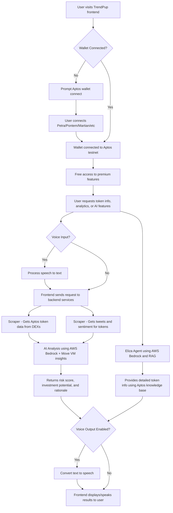

# TrendPup - Aptos AI Memecoin Intelligence

**Advanced memecoin intelligence system for Aptos blockchain with voice-enabled AI interaction.**

## Supported Chains

- **Aptos Testnet** - Next-generation Move-based blockchain
- **Wallet Support** - Petra, Pontem, Martian, and other Aptos wallets

## Key Features

- 🤖 **AI-Powered Analysis** - AWS Bedrock integration for sophisticated token evaluation
- 🎤 **Voice Interface** - Natural speech input and high-quality voice output
- 🔗 **Aptos Integration** - Native support for Aptos Move-based smart contracts
- 📊 **Real-Time Data** - Live token tracking and social sentiment analysis
- 🛡️ **Scam Detection** - Advanced filtering to identify rugpulls and fake projects
- 💬 **Eliza AI Agent** - Conversational AI with retrieval-augmented generation
- � **No Subscription Required** - Free access to premium memecoin intelligence
- 🔮 **Move VM Analytics** - Specialized analysis for Aptos Move smart contracts

## Problem It Solves

An **AI-powered early detection system** specifically designed for **Aptos meme coins**, identifying **promising tokens before significant price movement** on the fastest-growing Move-based blockchain ecosystem.

Our **open-access model** democratizes memecoin intelligence - **no subscriptions, no barriers, just powerful AI analysis for everyone**.

## What Users Can Use It For

## What Users Can Use It For

Our AI-powered system helps users:

- **Discover high-potential Aptos meme coins early** - before major price surges, giving retail investors a critical edge in the Move ecosystem.
- **Automate Aptos token monitoring** - eliminating the need to manually scan Telegram, Twitter, DEXs, and trackers across the Aptos ecosystem.
- **Filter scams and rugpulls** - using behavioral and on-chain analysis to detect red flags on Aptos, making trading safer.
- **Identify real community momentum** - distinguishing organic growth from paid shills or bot activity in the Aptos ecosystem.
- **Level the playing field** - by reducing information asymmetry traditionally exploited by insiders, whales, and snipers.
- **Enter earlier for maximum ROI** - ensuring users don't miss the small window of explosive growth most meme coins experience early on.
- **Voice-enabled AI interaction** - use natural speech to query markets, get analysis, and receive trading insights hands-free.
- **Move smart contract analysis** - leverage specialized AI understanding of Aptos Move programming language for deeper insights.

## How It Improves the Status Quo

Traditional methods of discovering meme coins on Aptos have major flaws:

- Discovering tokens **after** the pump = missed profits  
- **Manual research** across Aptos DEXs wastes time and is error-prone  
- Hard to tell a **genuine project** from a scam in the rapidly evolving Aptos ecosystem  
- **Insiders and bots** always move first on new Move-based tokens  
- Most tools can't separate **real hype from fake** in the Aptos community  
- Retail traders often miss the **early-entry sweet spot** in the fast-growing Move ecosystem  
- **No specialized tools** for analyzing Move smart contracts and Aptos-specific token mechanics

Our system solves all of this — and **provides free access to advanced AI memecoin intelligence**.

## TrendPup Project Architecture Flow

**Component Breakdown**

- **Hosting:**  
  All services are hosted on GCP (Google Cloud Platform) for reliability and scalability.

- **Frontend (Next.js):**  
  Handles Aptos wallet connection and user interface.  
  Supports multiple Aptos wallets including Petra, Pontem, Martian, and more.  
  Features voice input/output capabilities for hands-free AI interaction.

- **Scraper:**  
  Scrapes Aptos DEXs for token data across multiple protocols.  
  Scrapes Twitter for token-related tweets and sentiment analysis.  
  Monitors Aptos ecosystem for emerging opportunities.

- **AI Analysis (AWS Bedrock):**  
  Reads tweets and Aptos token data.  
  Determines risk score, investment potential, and provides rationale.  
  Specialized analysis for Aptos Move smart contracts and ecosystem dynamics.

- **Eliza Agent (AWS Bedrock + RAG):**  
  Advanced AI agent with Retrieval-Augmented Generation.  
  Answers user queries with the latest Aptos token data and in-depth analysis.  
  Supports natural voice interaction and text-to-speech responses.

- **Voice Interface:**  
  Speech recognition for natural voice commands and queries.  
  High-quality text-to-speech with customizable voice selection.  
  Hands-free trading insights and market analysis.

- **Aptos Integration:**  
  Native support for Aptos Move programming language analysis.  
  Integration with Aptos testnet for real-time blockchain data.  
  Multi-wallet support for seamless user experience.

**Summary:**  
This system provides free access to premium memecoin intelligence for all Aptos users. The backend aggregates real-time blockchain and social data from the Aptos ecosystem, then leverages advanced AI (AWS Bedrock) for investment analysis and conversational intelligence, all orchestrated through a modern Next.js frontend with voice-enabled interaction capabilities and specialized Move smart contract analysis.

---

**TrendPup** - Democratizing memecoin intelligence on Aptos with cutting-edge AI and voice interaction.
