# TrendPup - Aptos AI Memecoin Intelligence

**Premium AI-powered memecoin intelligence system for Aptos blockchain with voice-enabled interaction and smart contract access control.**

## Supported Chains

- **Aptos Testnet** - Next-generation Move-based blockchain
- **Wallet Support** - Petra, Pontem, Martian, and other Aptos wallets
- **Smart Contract** - Deployed Move contract for access control

## Key Features

- 🤖 **AI-Powered Analysis** - Google Vertex AI integration for sophisticated token evaluation
- 🎤 **Voice Interface** - Natural speech input and high-quality voice output
- 🔗 **Aptos Integration** - Native support for Aptos Move-based smart contracts
- 📊 **Real-Time Data** - Live token tracking and social sentiment analysis
- 🛡️ **Scam Detection** - Advanced filtering to identify rugpulls and fake projects
- 💬 **Custom AI Agent** - Conversational AI with retrieval-augmented generation
- 💎 **Premium Access** - Smart contract-based 30-day access for 1 APT
- 🔮 **Move VM Analytics** - Specialized analysis for Aptos Move smart contracts
- 🔐 **Access Control** - Decentralized payment system via Aptos Move smart contract

## Problem It Solves

An **AI-powered early detection system** specifically designed for **Aptos meme coins**, identifying **promising tokens before significant price movement** on the fastest-growing Move-based blockchain ecosystem.

Our **premium access model** provides **professional-grade memecoin intelligence** with a simple **1 APT payment for 30-day access** - no recurring subscriptions, just transparent blockchain-based pricing.

## Access & Pricing

- **🎯 Premium Access**: 1 APT = 30 days of full platform access
- **🔗 Smart Contract**: Transparent, decentralized payment system
- **💰 Fair Pricing**: No hidden fees, no recurring charges
- **⚡ Instant Access**: Pay once via Aptos wallet, access immediately
- **🔐 Secure**: All payments handled by audited Move smart contract

## Value Proposition Chart

```mermaid
graph LR
    A[Traditional Methods] --> B[Manual Research]
    A --> C[Late Discovery]
    A --> D[High Risk]
    A --> E[Expensive Tools]
    
    F[TrendPup AI] --> G[Automated Analysis]
    F --> H[Early Detection]
    F --> I[Risk Mitigation]
    F --> J[Fair Pricing: 1 APT]
    
    B --> K[❌ Time Consuming]
    C --> L[❌ Missed Profits]
    D --> M[❌ Scam Exposure]
    E --> N[❌ $100+ Monthly]
    
    G --> O[✅ Instant Results]
    H --> P[✅ First Mover Advantage]
    I --> Q[✅ Scam Protection]
    J --> R[✅ $6-8 for 30 Days]
    
    style F fill:#ff6b35
    style A fill:#cccccc
```

## What Users Can Use It For

Our premium AI-powered system helps users:

- **Discover high-potential Aptos meme coins early** - before major price surges, giving retail investors a critical edge in the Move ecosystem.
- **Automate Aptos token monitoring** - eliminating the need to manually scan Telegram, Twitter, DEXs, and trackers across the Aptos ecosystem.
- **Filter scams and rugpulls** - using behavioral and on-chain analysis to detect red flags on Aptos, making trading safer.
- **Identify real community momentum** - distinguishing organic growth from paid shills or bot activity in the Aptos ecosystem.
- **Level the playing field** - by reducing information asymmetry traditionally exploited by insiders, whales, and snipers.
- **Enter earlier for maximum ROI** - ensuring users don't miss the small window of explosive growth most meme coins experience early on.
- **Voice-enabled AI interaction** - use natural speech to query markets, get analysis, and receive trading insights hands-free.
- **Move smart contract analysis** - leverage specialized AI understanding of Aptos Move programming language for deeper insights.
- **Premium intelligence access** - 30-day unlimited access to all features for just 1 APT payment.

## AI Analysis Pipeline

## How It Improves the Status Quo

Traditional methods of discovering meme coins on Aptos have major flaws:

- Discovering tokens **after** the pump = missed profits  
- **Manual research** across Aptos DEXs wastes time and is error-prone  
- Hard to tell a **genuine project** from a scam in the rapidly evolving Aptos ecosystem  
- **Insiders and bots** always move first on new Move-based tokens  
- Most tools can't separate **real hype from fake** in the Aptos community  
- Retail traders often miss the **early-entry sweet spot** in the fast-growing Move ecosystem  
- **No specialized tools** for analyzing Move smart contracts and Aptos-specific token mechanics
- **Expensive subscriptions** that don't deliver consistent value

Our system solves all of this with **transparent 1 APT pricing** and **professional-grade AI memecoin intelligence**.

## Market Opportunity Analysis

## TrendPup System Architecture

## Smart Contract Access Control Flow

## Technology Stack Overview

**Component Breakdown**

- **Hosting:**  
  All services are hosted on GCP (Google Cloud Platform) for reliability and scalability.

- **Frontend (Next.js):**  
  Handles Aptos wallet connection and user interface.  
  Supports multiple Aptos wallets including Petra, Pontem, Martian, and more.  
  Features voice input/output capabilities for hands-free AI interaction.  
  Integrated access control system with smart contract payment processing.

- **Smart Contract (Move):**  
  Deployed on Aptos testnet for transparent access control.  
  Handles 1 APT payments for 30-day access periods.  
  Decentralized and auditable payment system.  
  Contract Address: `0x19476157bb73de0e8a55568264d111eadfc6503b8c798f0525760e540b18e7cb`

- **Scraper:**  
  Scrapes Aptos DEXs for token data across multiple protocols.  
  Scrapes Twitter for token-related tweets and sentiment analysis.  
  Monitors Aptos ecosystem for emerging opportunities.

- **AI Analysis (Vertex AI):**  
  Reads tweets and Aptos token data.  
  Determines risk score, investment potential, and provides rationale.  
  Specialized analysis for Aptos Move smart contracts and ecosystem dynamics.

- **Custom Agent (Vertex AI + RAG):**  
  Advanced AI agent with Retrieval-Augmented Generation.  
  Answers user queries with the latest Aptos token data and in-depth analysis.  
  Supports natural voice interaction and text-to-speech responses.

- **Voice Interface:**  
  Speech recognition for natural voice commands and queries.  
  High-quality text-to-speech with customizable voice selection.  
  Hands-free trading insights and market analysis.

- **Access Control System:**  
  Smart contract-based premium access control.  
  Transparent 1 APT pricing for 30-day access.  
  Automatic access verification and time tracking.  
  Seamless wallet integration for payment processing.

- **Aptos Integration:**  
  Native support for Aptos Move programming language analysis.  
  Integration with Aptos testnet for real-time blockchain data.  
  Multi-wallet support for seamless user experience.

## Feature Comparison Matrix

```mermaid
graph TB
    subgraph "TrendPup Features"
        A[✅ AI Analysis]
        B[✅ Voice Interface]
        C[✅ Scam Detection]
        D[✅ Move Contract Analysis]
        E[✅ Real-time Data]
        F[✅ 1 APT Fair Pricing]
        G[✅ Multi-wallet Support]
        H[✅ Early Detection]
    end
    
    subgraph "Traditional Tools"
        I[❌ Manual Research]
        J[❌ Text Only]
        K[❌ Basic Filtering]
        L[❌ No Move Support]
        M[❌ Delayed Data]
        N[❌ $100+ Monthly]
        O[❌ Limited Wallets]
        P[❌ Late Discovery]
    end
    
    style A fill:#32cd32
    style B fill:#32cd32
    style C fill:#32cd32
    style D fill:#32cd32
    style E fill:#32cd32
    style F fill:#32cd32
    style G fill:#32cd32
    style H fill:#32cd32
    
    style I fill:#ff4444
    style J fill:#ff4444
    style K fill:#ff4444
    style L fill:#ff4444
    style M fill:#ff4444
    style N fill:#ff4444
    style O fill:#ff4444
    style P fill:#ff4444
```

## ROI Potential Analysis

**Summary:**  
This system provides premium memecoin intelligence for Aptos users through a transparent 1 APT payment model. The backend aggregates real-time blockchain and social data from the Aptos ecosystem, then leverages advanced AI (Vertex AI) for investment analysis and conversational intelligence, all orchestrated through a modern Next.js frontend with voice-enabled interaction capabilities, specialized Move smart contract analysis, and decentralized access control.

---

## Getting Started

### Prerequisites
- Aptos wallet (Petra, Pontem, or Martian)
- Minimum 1 APT for premium access
- Modern web browser with microphone support (for voice features)

### Quick Start
1. **Connect Wallet**: Visit TrendPup and connect your Aptos wallet
2. **Purchase Access**: Pay 1 APT for 30-day premium access via smart contract
3. **Start Analyzing**: Use voice or text to query AI about Aptos memecoins
4. **Get Insights**: Receive real-time analysis, risk scores, and trading recommendations

### Features Included in Premium Access
- ✅ AI-powered memecoin analysis
- ✅ Real-time market intelligence  
- ✅ Scam detection & risk scoring
- ✅ Voice-enabled AI assistant
- ✅ Aptos Move contract insights
- ✅ Social sentiment analysis
- ✅ Early detection algorithms
- ✅ 30-day unlimited access

## Success Metrics

---

**TrendPup** - Professional memecoin intelligence on Aptos with cutting-edge AI and transparent pricing.
